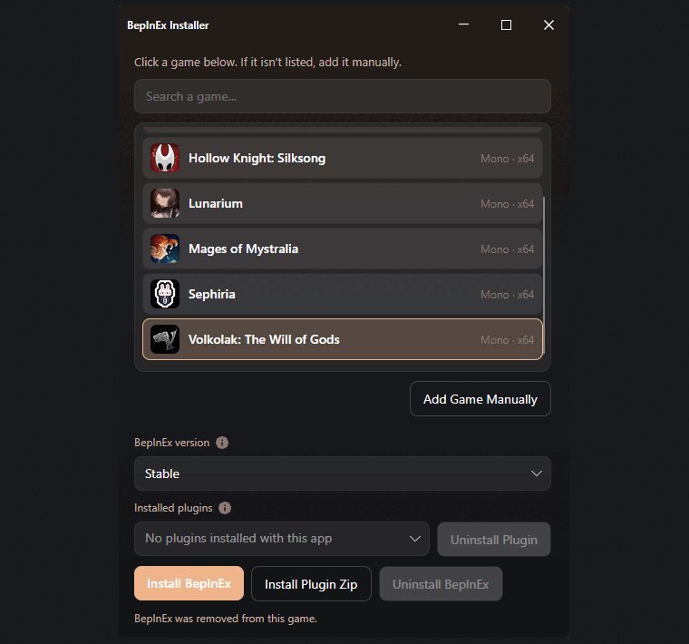

# BepInEx Installer

A small desktop app for installing [BepInEx](https://github.com/BepInEx/BepInEx) into Unity games. Pick a Steam title, choose **Stable** or **Bleeding Edge**, and install. Optional: drop in a plugin zip.

This is a community installer. It is not affiliated with BepInEx or Unity.

The UI matches [UE4SS Installer](https://github.com/mattdavida/ue4ss-Installer): same Avalonia layout, Steam scan, handheld mode, and manifest-tracked uninstall.

Official Windows builds will be on [GitHub Releases](https://github.com/mattdavida/BepInEx-Installer/releases).

<p align="center">
  
</p>

## Windows may warn you

This app is not code-signed yet, so Windows SmartScreen often shows **Windows protected your PC** on first run. That is Windows treating an unknown exe as untrusted, not a verdict that the file is malware. Click **More info**, then **Run anyway**.

Antivirus tools sometimes flag `winhttp.dll` next to a game exe. BepInEx loads that way on purpose (UnityDoorstop). It is not extra software this installer invented.

## Use it

1. Open the app. It scans Steam for Unity games (`*_Data` + companion exe, same check as MelonLoader.Installer).
2. Click a game. If it is missing, **Add Game Manually** and pick the Steam install folder (Manage → Browse local files).
3. The list shows **Mono / IL2CPP** and **x86 / x64**. IL2CPP games are switched to Bleeding Edge automatically.
4. **Install BepInEx**.

**Stable** is the newest BepInEx 5 zip from GitHub `/releases/latest` (`BepInEx_win_x64_*.zip`, and the matching x86 / Linux / macOS asset). It only supports Unity Mono.

**Bleeding Edge** walks recent GitHub releases (including prereleases) for a BepInEx 6 pack named `BepInEx-Unity.{Mono|IL2CPP}-{os}-{arch}-*.zip`. IL2CPP games need this channel.

V Rising is pinned to the [community pack](https://github.com/decaprime/VRising-Modding/releases/tag/1.733.2) (`1.733.2`). Garden of Witches is pinned to [BepInEx 6.0.0-be.785](https://builds.bepinex.dev/projects/bepinex_be). The Rogue Prince of Persia and Tainted Grail: The Fall of Avalon are pinned to [6.0.0-be.788](https://builds.bepinex.dev/projects/bepinex_be) (all three are IL2CPP metadata v31; the last two are Unity 6). Stock GitHub Bleeding Edge (`pre.2`, build 697) cannot read those games' IL2CPP metadata.

Prince of Persia: The Lost Crown stays on stock Bleeding Edge (metadata v29). The installer turns on Doorstop's `ignore_disable_switch` and sets `UnityLogListening` off. The game sets `DOORSTOP_DISABLE`, so without that switch BepInEx never starts, and Unity log listening crashes the launch once it does.

Skul stays on **Stable**. The installer also downloads unstripped Unity **2020.3.34** corlibs and engine assemblies from [unity.bepinex.dev](https://unity.bepinex.dev/) into `unstripped_corlib` and sets Doorstop's `dll_search_path_override`. Without that, BepInEx 5 dies immediately (`MissingMethodException: Module.GetPEKind`) because the game's `mscorlib` is linker-stripped. The log console never appears in that state.

After one install with this app, switching channels cleans files this installer previously extracted. Same-channel updates keep `doorstop_config.ini` and `BepInEx/config/`. Manual BepInEx copies are not tracked, so leftovers can remain until you install once through the app.

**Uninstall BepInEx** deletes the `BepInEx` folder (plugins and config included) and Doorstop files such as `winhttp.dll`. Close the game first if a file is locked.

**Show log console** writes `[Logging.Console] Enabled` in `BepInEx/config/BepInEx.cfg` so you do not have to edit that file after first launch. If the cfg is missing, the installer creates it. Launch the game after changing the toggle.

**Configuration Manager (F1)** is optional. After BepInEx is installed, check the box to download [BepInEx.ConfigurationManager](https://github.com/BepInEx/BepInEx.ConfigurationManager) (BepInEx 5 zip for Stable Mono, IL2CPP zip for IL2CPP games). Uncheck to remove it. There is no official BepInEx 6 Mono build, so the box is hidden for Mono + Bleeding Edge. On some IL2CPP games the in-game menu never appears because Unity IMGUI is stripped.

## Install a plugin zip

**Install Plugin Zip** looks at the archive (and one wrapper folder, if present):

- Full pack (`winhttp.dll` / `doorstop_config.ini` + `BepInEx/`) or a `BepInEx/` overlay → extracted into the game folder
- Anything else → extracted into `BepInEx/plugins` (a leading `plugins/` folder is stripped)

Plugins installed with this app are listed under **Installed plugins** and can be removed with **Uninstall Plugin**. That also deletes matching `BepInEx/config/{guid}.cfg` files created on first launch (BepInEx's own `BepInEx.cfg` is left alone).

## Steam Deck / Linux

Proton Unity games still use the Windows BepInEx zip (the game exe is a PE). Native Linux Unity games get the Linux zip. After you download the Linux build, mark it executable:

```bash
chmod +x BepInExInstaller
```

## Build from source

Requires the [.NET 9 SDK](https://dotnet.microsoft.com/download).

```bash
dotnet test
dotnet run
```

Official Windows downloads are produced by `.github/workflows/ci.yml` on a `v*` tag. `deploy.ps1` is for local iteration only.

Standalone builds (no .NET install on the target machine). One file: `BepInExInstaller.exe` on Windows, `BepInExInstaller` on Linux.

```powershell
.\deploy.ps1
.\deploy.ps1 -Linux
.\deploy.ps1 -All
```

Optional `BEPINEX_INSTALLER_GITHUB_TOKEN` / `GITHUB_TOKEN` bypasses GitHub API rate limits. `BEPINEX_INSTALLER_LAYOUT=handheld|desktop` forces the Steam Deck layout.

## Credits

BepInEx: [BepInEx/BepInEx](https://github.com/BepInEx/BepInEx)

Configuration Manager is [BepInEx.ConfigurationManager](https://github.com/BepInEx/BepInEx.ConfigurationManager) (LGPL-3.0). This installer only downloads it.
